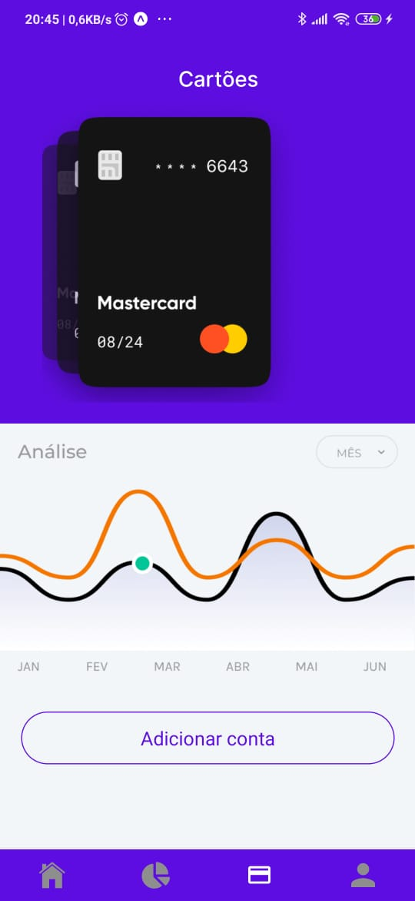
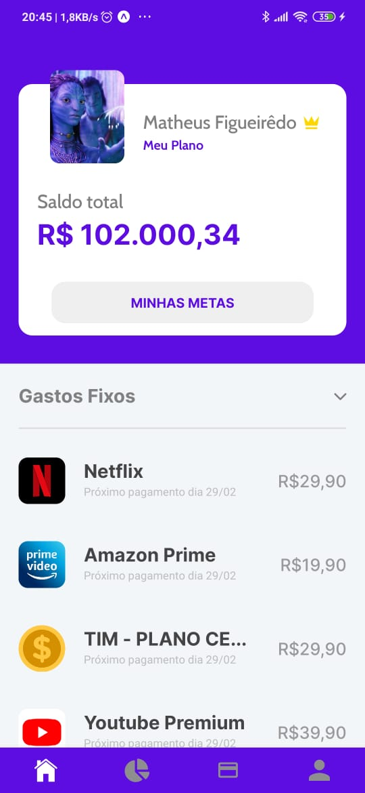
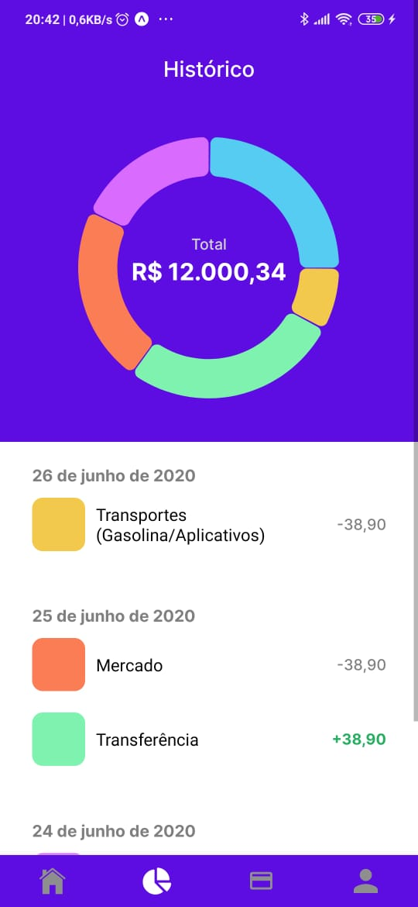

   

# Bússola Financeira

 

> There ain't such thing as free lunch!

To download the app: The **.apk** file which can be downloaded [here](https://drive.google.com/drive/folders/17fbCnVLj_lAa8aUmqjZJllz1QEtCucrT?usp=sharing) or just scan the **QRCODE**:

---

# :pushpin: Summary

- [Description](#pencil-description)
- [Features](#rocket-features)
- [Installation](#construction_worker-installation)
- [Getting Started](#runner-getting-started)
- [Issues](#bug-issues)
- [License](#closed_book-license)

# :pencil: Description

The **Bússola Financeira** 🧭 is an app that will **upgrade** :sparkles: your experience managing your own **money**. It's a modern platform that integrates all of your bank accounts in one dashboard, plan goals and alternatives for **saving money** based on your profile and transaction history.  Through _Machine Learning_ e _Artificial Intelligence_ we secure the best decisions for investments, and even precise spending cut specially for helping you to **reach your goals** :dart:.

# :star: Features

- Custom spending suggestions based on your financial profile
- Automatic investment of your payment's change (Ex.: U\$ 7,20 spent so U\$ 0,80 is invested)

- Analysis of you financial historic and future projection of you possible gains/economies.
- Assistant based interaction (Google Assistant/Alexa)
- Finding people with the same profile as yours to recommend the best investments/

# :construction_worker: Installation

You'll need to install [Node.js](https://nodejs.org/en/download/) and [Yarn](https://yarnpkg.com/) first.

Then, install the [expo-cli](https://docs.expo.io/workflow/expo-cli) globally and you'll just need to clone the project with:

`git clone https://github.com/matheussousaf/bussola-financeira`

# :rocket: Getting Started

To start the **app** in develoment mode:

`yarn dev`

Obs.: You have to have the [expo-cli](https://docs.expo.io/workflow/expo-cli) globally installed on your machine.

# :bug: Issues

Feel free to **open a new issue** in the [Bússola Financeira official repository](https://github.com/matheussousaf/bussola-financeira). If you already got a solution for your problem, feel free to send a **pull request** according to the [contributing guide](https://github.com/matheussousaf/bussola-financeira/master/CONTRIBUTING.md).

# :closed_book: License

Released in 2020 for the TecBan Hackathon.
This project is under the [MIT license](https://github.com/https://github.com/matheussousaf/bussola-financeira/LICENSE).
